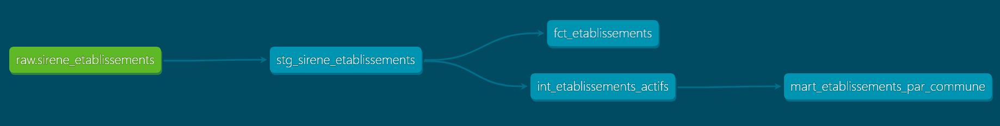

# Pipeline SIRENE Loire-Atlantique — dbt + Snowflake

[](https://github.com/Alanandre01/sirene-nantes-snowflake/actions/workflows/dbt_ci.yml)

Pipeline de données analytique sur les établissements de Loire-Atlantique (44)
construit avec **dbt Core** et **Snowflake**, dans le cadre d'une transition
vers le Data Engineering — ciblant le marché français.

---

## Architecture

```
data.gouv.fr (SIRENE mensuel Parquet)
│
▼
Snowflake RAW                     ← ALAN_DW.RAW.SIRENE_ETABLISSEMENTS
│
▼
dbt staging (view)                ← nettoyage, cast, macro clean_nd()
│
▼
dbt marts (tables)                ← modèles analytiques + modèle incrémental
```



| Couche | Schema Snowflake | Matérialisation | Rôle |
|--------|-----------------|-----------------|------|
| raw | `ALAN_DW.RAW` | table externe (hors dbt) | Données brutes Parquet SIRENE |
| staging | `ALAN_DW.DBT_DEV_STAGING` | view | Nettoyage, typage, renommage métier |
| intermediate | aucun objet Snowflake | ephemeral | Filtres injectés en CTE |
| marts | `ALAN_DW.DBT_DEV_MARTS` | tables | Modèles analytiques finaux |

---

## Stack technique

| Couche | Outil | Justification |
|---|---|---|
| Stockage brut | Parquet → Snowflake | Format colonnaire, performances 5–10x vs CSV |
| Data warehouse | Snowflake | Standard dominant du marché DE français en 2026 |
| Transformation | dbt Core | ELT moderne — tests, docs, lineage intégrés |
| Qualité | dbt tests + dbt_expectations | Validation à chaque run |
| Versioning | Git + GitHub | Historique traçable |

---

## Source de données

**Base SIRENE** — INSEE via [data.gouv.fr](https://www.data.gouv.fr/fr/datasets/base-sirene-des-entreprises-et-de-leurs-etablissements-siren-siret/)

- Périmètre : établissements du département **Loire-Atlantique (44)**
- Format source : Parquet (StockEtablissement mensuel)
- Licence : [ODbL](https://opendatacommons.org/licenses/odbl/)
- Table brute : `ALAN_DW.RAW.SIRENE_ETABLISSEMENTS`

> **Piège technique** : la colonne `DATE_CREATION_ETAB` est un timestamp en
> microsecondes epoch — inutilisable directement. Toutes les analyses temporelles
> utilisent `DATE_CREATION_ETAB_PARSED` (colonne pré-parsée).

---

## Modèles dbt

### Staging — `stg_sirene_etablissements` (view)

- Nettoyage des valeurs `[ND]` via la macro `clean_nd()` (gère aussi les chaînes vides)
- Cast des colonnes date depuis `DATE_CREATION_ETAB_PARSED`
- Conversion booléenne de `ETABLISSEMENT_SIEGE` (`'oui'` → `true`)
- Renommage des colonnes en noms métier snake_case
- Filtres qualité : SIRET mal formé, `ANNEE=1900` (sentinelle), `MOIS` hors 1–12

### Marts (tables)

| Modèle | Description |
|---|---|
| `fct_etablissements` | Modèle incrémental principal — une ligne par SIRET×partition mensuelle |
| `mart_etablissements_par_commune` | Agrégat des établissements actifs par commune |

### Matérialisations — pourquoi ces choix

```
staging      → view        : toujours frais, pas de stockage dupliqué
intermediate → ephemeral   : injecté en CTE, aucun objet créé dans Snowflake
marts        → table       : performant pour BI, requêtes fréquentes
fct_*        → incremental : ne retraite que les nouvelles partitions mensuelles
```

---

## Modèle incrémental — idempotence

Le modèle `fct_etablissements` est **incrémental avec stratégie merge** :

```sql
{{ config(
    materialized         = 'incremental',
    unique_key           = 'etablissement_sk',
    incremental_strategy = 'merge',
    on_schema_change     = 'sync_all_columns'
) }}


WHERE partition_annee_mois > (
    SELECT MAX(partition_annee_mois) FROM {{ this }}
)

```

La clé `etablissement_sk` est un hash MD5 généré par `dbt_utils.generate_surrogate_key(['siren', 'nic', 'partition_annee_mois'])` — stable, indépendant de la source, unique par établissement×snapshot.

**Idempotence** : relancer ce modèle plusieurs fois sans nouvelles données produit
toujours le même résultat — aucune ligne dupliquée, aucune donnée corrompue.

### Performance mesurée

Mesures réelles sur le dataset Loire-Atlantique (Snowflake, mai 2026) :

| Run type | Lignes traitées | Temps Snowflake |
|---|---|---|
| Full-refresh | 391 255 | 2.75 s |
| Incrémental (nouvelle partition) | 2 | 4.34 s |

> À ce volume (~400K lignes), le full-refresh est plus rapide que l'incrémental
> en raison du surcoût fixe du MERGE. L'incrémental devient rentable au-delà de
> plusieurs millions de lignes et est maintenu pour anticiper la croissance.

---

## Qualité des données

Tests dbt appliqués à chaque run (`dbt test`) :

- `not_null` sur `siret`, `siren`, `etablissement_sk`, `etat_etablissement`
- `unique` sur `etablissement_sk` (clé de substitution composite)
- `accepted_values` sur `etat_etablissement` (`Actif`, `Fermé`)
- `accepted_values` sur `statut_diffusion` (`O`, `P`) — source SIRENE
- `accepted_values` sur `code_departement` (`44`) — garantit le périmètre
- `dbt_expectations.expect_table_row_count_to_be_between` — détecte les truncations
- `dbt_expectations.expect_column_value_lengths_to_equal(14)` — SIRET toujours 14 chiffres
- `dbt_expectations.expect_column_values_to_be_between` — `annee_snapshot` entre 1901 et 2100

---

## Conformité RGPD

La base SIRENE contient des données personnelles pour les **entrepreneurs individuels**.
Le champ `STATUT_DIFFUSION` est le signal RGPD central :

- `O` → données totalement diffusables
- `P` → l'entrepreneur a exercé son droit d'opposition — les champs personnels
  sont remplacés par `[ND]`, convertis en `NULL` par la macro `clean_nd()`

### Colonnes PII identifiées

| Colonne (staging) | Catégorie RGPD | Traitement |
|---|---|---|
| `siret` / `siren` / `nic` | Identifiant direct | `pii: true` dans schema.yml |
| `denomination` | Donnée personnelle potentielle (EI) | NULL si `statut_diffusion = P` |
| `code_postal` / `commune` / `code_commune` | Localisation | NULL si `statut_diffusion = P` |
| `date_creation_etab` / `date_creation_ul` | Donnée temporelle | Accessible, non masquée |
| `statut_diffusion` | Métadonnée de conformité RGPD | `pii: false` |

> Toutes les colonnes PII sont marquées `meta: {pii: true}` dans les fichiers
> `schema.yml` — visible dans la documentation dbt (`dbt docs serve`).

---

## Pièges SIRENE documentés

| Problème | Solution appliquée |
|---|---|
| Valeurs manquantes encodées `[ND]` | Macro `clean_nd()` — gère `[ND]` et chaînes vides |
| `DATE_CREATION_ETAB` en epoch microsecondes | Ignorée — `DATE_CREATION_ETAB_PARSED` utilisée |
| `ANNEE = 1900` = année inconnue | Filtré par `WHERE CAST(ANNEE AS INTEGER) != 1900` |
| `MOIS` hors 1–12 (ex : 99) | Filtré par `MOIS BETWEEN 1 AND 12` |
| `ETABLISSEMENT_SIEGE` en `'oui'`/`'non'` | Converti en booléen : `ETABLISSEMENT_SIEGE = 'oui'` |

---

## Lancer le projet

```powershell
# Activer le venv
.venv\Scripts\activate

# Variables d'environnement (ne jamais committer)
$env:SNOWFLAKE_ACCOUNT  = "ton-account-id"
$env:SNOWFLAKE_USER     = "ton-user"
$env:SNOWFLAKE_PASSWORD = "ton-password"

# Vérifier la connexion
dbt debug

# Installer les packages dbt (dbt_utils + dbt_expectations)
dbt deps

# Build complet (modèles + tests)
dbt build

# Run incrémental uniquement
dbt run --select fct_etablissements

# Rechargement complet depuis zéro
dbt run --select fct_etablissements --full-refresh

# Générer et servir la documentation
dbt docs generate
dbt docs serve
```

---

## Structure du projet

```
sirene_nantes/
├── models/
│   ├── staging/
│   │   ├── stg_sirene_etablissements.sql
│   │   ├── stg_sirene_etablissements.yml  ← colonnes PII documentées
│   │   └── sources.yml                   ← source RAW + meta RGPD
│   ├── intermediate/
│   │   └── int_etablissements_actifs.sql  ← ephemeral, injecté en CTE
│   └── marts/
│       ├── fct_etablissements.sql         ← modèle incrémental principal
│       ├── mart_etablissements_par_commune.sql
│       └── schema.yml                    ← tests dbt_expectations
├── macros/
│   └── clean_nd.sql                      ← remplace [ND] et chaînes vides par NULL
├── packages.yml                          ← dbt_utils + dbt_expectations
├── dbt_project.yml
└── README.md
```
