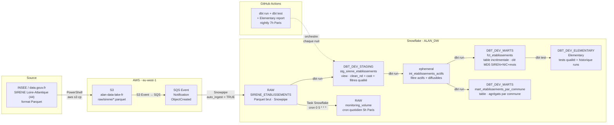

# Architecture - Pipeline Sirene Nantes

## Schéma du pipeline



## Couches de données

| Couche | Schéma Snowflake | Matérialisation | Rôle |
|---|---|---|---|
| Ingestion | `ALAN_DW.RAW` | Table (Snowpipe) | Données brutes, jamais modifiées par dbt |
| Staging | `ALAN_DW.DBT_DEV_STAGING` | View | Macro `clean_nd` : `[ND]` → NULL, cast types, filtres qualité (SIRET 14c, ANNEE≠1900, MOIS 1–12) |
| Intermediate | *(ephemeral)* | Ephemeral | Filtre actifs + diffusibles - injecté en CTE, pas de table créée |
| Marts | `ALAN_DW.DBT_DEV_MARTS` | Table | Modèles analytiques finaux (fct + mart) |
| Monitoring | `ALAN_DW.DBT_DEV_ELEMENTARY` | Tables Elementary | Historique des tests de qualité et des runs dbt |

## Lineage dbt

```
RAW.SIRENE_ETABLISSEMENTS
  └── stg_sirene_etablissements  (view)
        ├── int_etablissements_actifs  (ephemeral → CTE)
        │     ├── fct_etablissements            (table incrémentale - modèle principal)
        │     └── mart_etablissements_par_commune (table - agrégats BI)
        └── [Elementary capture tous les tests]
```

## Décisions techniques clés

| Décision | Choix | Justification |
|---|---|---|
| Warehouse | Snowflake (EU) | Standard du marché français, Time Travel + RGPD |
| Format stockage | Parquet | Compression 5–10x vs CSV, lecture colonnaire |
| Transformation | dbt Core (ELT) | SQL versionné, tests intégrés, lineage auto |
| Ingestion auto | Snowpipe + SQS | Déclenchement event-driven, pas de polling |
| Modèle incrémental | Merge sur surrogate key MD5 | Idempotent, ne recharge que les nouvelles partitions `YYYY-MM` |
| Orchestration CI | GitHub Actions | Gratuit, intégré au repo, nightly schedule |
| Qualité données | dbt_expectations + Elementary | Tests déclaratifs + rapport HTML |
| RGPD | Procédure `ANONYMISER_ETABLISSEMENT` + audit log | Conformité Art. 5 et Art. 17 RGPD |

## Objets Snowflake hors dbt

| Objet | Nom | Rôle |
|---|---|---|
| Storage Integration | `S3_INT_SIRENE` | Accès IAM Snowflake → S3 |
| Stage | `ALAN_DW.RAW.STG_S3_SIRENE` | Pointe sur `s3://alan-data-lake-fr/raw/sirene/` |
| Pipe | `ALAN_DW.RAW.PIPE_SIRENE_ETABLISSEMENTS` | Auto-ingest SQS → table RAW |
| Task | `task_monitoring_volume` | INSERT quotidien dans `monitoring_volume` (cron 5h Paris) |
| Table | `ALAN_DW.RAW.RGPD_AUDIT_LOG` | Journal immuable des effacements Art. 17 |
| Procédure | `ALAN_DW.RAW.ANONYMISER_ETABLISSEMENT` | Effacement PII ciblé par SIREN |
